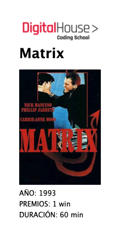

App made as a practice in the Full Stack Developer course of Digital House.

The App consumes data through an internal and an external API. The movie will be searched first in the internal database and if it is not found, it will be consumed through an external api.

I also added a CRUD and a registration/login with their respective middlewares. It also allows you to sort them by release date.

🤜Technologies used: html, css, javascript, express, node.js, sequelize, ejs. 🤛 
